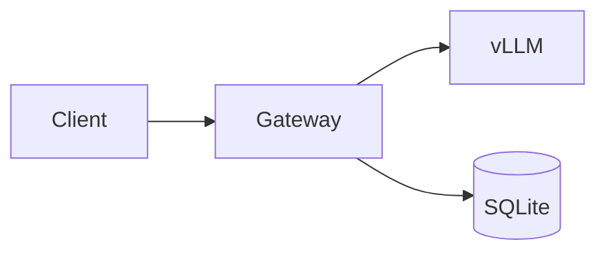

# korean-tech-blog-authoring

한국어로 기술 글을 쓰면 영문 글과는 다른 패턴이 필요하다 — 문체(격식체/평어)가 글의 톤을 좌우하고, 영문 식별자를 무리하게 한글로 바꾸면 오히려 어색해지며, "configuration을 set한다" 같은 외래어 혼합은 가독성을 죽인다. AI가 쓴 글은 "그것은 ~이다", "~함으로써" 같은 번역체나 너무 매끈한 문어체로 정체가 드러난다. 아래 6 원칙은 한국어 기술 블로그/매뉴얼/책 챕터에서 반복적으로 확인된 패턴을 정리한 것이다. 영문 글 작성에는 별도 가이드(영문 작성 skill)를 사용한다.

## 사용 시점

- "한국어 기술 블로그 / 한글 아티클 / 기술서적 챕터"
- "한국어로 자연스럽게 / 번역체 빼고 / AI 흔적 없이"
- "격식체 vs 평어 어떤 걸 쓸지", "혼용 문체 정리"
- "영문 식별자(코드/명령/라이브러리) 어디까지 한글로", "기술 용어 한국어 선택"
- "코드 인용 / 다이어그램 / 표 한국어 기술 글에서 어떻게"
- "한/영 mirror 작성 시 한국어 쪽 가이드"

## 6 원칙 한눈에

| # | 원칙 | 핵심 |
|---|---|---|
| 1 | 격식체 vs 평어 | 책 `-한다`, 블로그/매뉴얼 `-합니다`, 한 글 안에서 혼용 금지 |
| 2 | 영문 식별자 보존 | 코드/명령/파일명/라이브러리는 영문 그대로, 설명만 한글 |
| 3 | 한국어 기술 용어 선택 | 영문 음차가 친숙한 건 그대로, 의미 다른 한글로 옮기지 않기 |
| 4 | 코드 인용 형식 | fenced (```python) + 인라인 `code` + `path:line` 명시 |
| 5 | 다이어그램 통합 | Mermaid + SVG 변환, 앞뒤 한 줄 설명/해석 |
| 6 | 명확한 구조 | H1/H2/H3 위계 + 인용문 박스 + 표/리스트 적재적소 |

## 1. 격식체 vs 평어

한 글 안에서 문체를 섞으면 어색하다. 매체별로 default를 정해놓고 흔들지 않는다.

| 매체 | 추천 문체 | 예시 |
|---|---|---|
| 책 / 논문 | `-한다` 격식 | "이 함수는 토큰을 카운트한다." |
| 블로그 포스트 | `-합니다` 친근 / 또는 `-한다` 일관 | "이 함수는 토큰을 카운트합니다." |
| 인터넷 매뉴얼 / 튜토리얼 | `-합니다` (사용자에게 직접) | "먼저 의존성을 설치합니다." |
| 인터널 문서 / 변경 로그 | `-한다` 또는 명사형 | "토큰 카운터 추가." |

핵심:
- **한 문서 안에서는 한 가지로.** "~합니다" 단락 끝에 "~이다" 결론이 붙으면 톤이 깨진다.
- 책 안에서도 챕터별 일관성. 책 전체 통일이 가장 강력하다.
- 블로그에서 `-합니다`/`-한다` 혼용은 가능하지만 **단락 단위로 분리**한다 (목차/요약은 명사형, 본문은 `-합니다`).

## 2. 영문 식별자 보존

```
코드: scripts/build-docs.sh:42
라이브러리: FastAPI, vLLM, SQLAlchemy
명령: kubectl apply -f deploy.yaml
환경변수: GATEWAY_ADMIN_KEY
```

**바꾸지 않는다:**
- 라이브러리/프레임워크 이름 (FastAPI ≠ "패스트API")
- 명령어 / 옵션 / 플래그 (`--disable-log-requests`)
- 파일 경로 / 클래스 / 함수명 (`build_docs.py`, `TokenCounter`)
- 환경변수 / API 엔드포인트 (`/v1/chat/completions`)

**한글로 옮긴다:**
- 설명 문장 ("이 옵션은 요청 로그를 끈다")
- 개념어 일부 (메모리, 프로세스, 캐시)
- 동사 ("실행하다", "호출하다", "반환하다")

원칙: **읽는 사람이 그대로 검색해서 맞아야 하는 문자열은 영문**. 의미를 풀어 설명하는 문장은 한글.

## 3. 한국어 기술 용어 선택

한국 개발자에게는 영문 음차가 더 친숙한 용어가 많다. 무리하게 한글화하면 오히려 가독성이 떨어진다.

| 영문 음차 (○) | 한글 번역 (보통 X) | 비고 |
|---|---|---|
| 런타임 | 실행 환경 | 음차가 친숙 |
| 워커 | 작업자 | "작업자"는 사람 느낌 |
| 캐시 | 저장소 | 의미 다름 (캐시 ≠ storage) |
| 컨테이너 | 그릇 | 한글화 자체가 부적절 |
| 디버깅 | 결함 제거 | 음차가 표준 |
| 핸들러 | 처리기 | 둘 다 가능, 일관성 유지 |

| 한글 번역 (○) | 영문 음차 (보통 X) | 비고 |
|---|---|---|
| 메모리 | (음차) | 한글이 표준 |
| 프로세스 | (음차) | 한글이 표준 |
| 함수 / 변수 / 인자 | function / variable / argument | 한글이 표준 |
| 의존성 | dependency | 한글이 표준 |

판단 기준:
- 한국 개발자 커뮤니티(블로그/공식 한글 문서)에서 어떤 표기가 더 흔한지 확인.
- "캐시"처럼 의미가 정확한 한글이 없는 경우 음차 우선.
- 본인 글 안에서 일관성. "런타임"과 "실행 환경"을 섞지 않는다.

## 4. 코드 인용 형식

````markdown
fenced code block에는 언어 명시:

```python
def count_tokens(text: str) -> int:
    return len(tokenizer.encode(text))
```

인라인은 짧은 표현 — `--disable-log-requests` 옵션, `GATEWAY_DB` 환경변수.

파일 경로는 line 명시:
- `scripts/build-docs.sh:42`
- `gateway/main.py:115-120`
````

세부 규칙:
- 코드 블록 앞에 한 줄 설명, 뒤에 한 줄 해석. 코드만 던지지 않는다.
- diff 보일 때는 `diff` 또는 `- old / + new` 라인 코멘트.
- 출력/로그 인용은 ```` ```text ```` 또는 ```` ```log ````.
- 너무 긴 코드는 `# ... (생략) ...` 처리. 책에서는 30 라인 넘으면 끊는다.

## 5. 다이어그램 통합

Mermaid 코드블럭을 작성하면 빌드 파이프라인(예: pandoc-bilingual-build)이 SVG로 자동 변환한다. 본문에는 SVG 이미지로 삽입.

````markdown

````

또는 미리 변환한 SVG 직접 참조:

```markdown

```

배치 규칙:
- 다이어그램 ID는 `diagram-NN` 형식 (한/영 mirror 시 양쪽이 같은 ID 공유).
- 다이어그램 **앞에 한 줄** ("게이트웨이가 요청을 받으면 SQLite에서 quota를 조회한 뒤 vLLM으로 포워딩한다.")
- 다이어그램 **뒤에 한 줄** ("이 구조에서 SQLite가 병목이 되는 시점은 5장에서 다룬다.")
- 다이어그램만으로 본문을 대체하지 않는다 — 다이어그램은 보강.

## 6. 명확한 구조

```markdown
# 글 제목 (H1, 1개)

> 학습 목표 박스 (인용문)

## 큰 섹션 (H2)

본문 단락. 한 단락은 3~5 문장.

### 소절 (H3)

표/리스트/코드. 표는 비교나 매트릭스에, 리스트는 순서 절차나 동등 항목에.

> 요점 정리 박스 (인용문, 마지막)
```

핵심:
- H1은 글 제목 1개. 본문 H2부터.
- H2 위에 짧은 도입 단락(2~3 문장)이 있으면 흐름이 부드럽다.
- 인용문(`>`)은 학습 목표 / 요점 정리 / 경고 박스로.
- 표는 **비교 또는 매트릭스**일 때만. 단순 나열은 리스트.

## 한국어 특화 함정

- **혼용 문체** — "이 함수는 토큰을 카운트한다. 결과를 캐시에 저장합니다." 한 단락에서 격식체와 친근체가 섞이면 어색.
- **번역체** — "그것은 ~이다", "~함으로써", "~을 위하여". 영어 직역 흔적. 한국어로는 "이는 ~이다", "~해서", "~하려고"가 자연스럽다.
- **수동태 남용** — "이 함수는 호출된다" → "이 함수를 호출한다". 영어는 수동을 자주 쓰지만 한국어 기술 글은 능동이 자연스럽다.
- **외래어 혼합** — "configuration을 set한다", "request를 send한다". 한쪽으로 통일 — "설정한다" 또는 "config를 적용한다", "요청을 보낸다" 또는 "request를 send한다(영문 코드 인용 맥락이면)".
- **AI 번역 흔적** — 너무 매끈한 문어체, 단락마다 정확히 같은 길이, 모든 문장이 `-한다`로 끝남. 사람의 글은 짧은 문장과 긴 문장이 섞이고, 가끔 강조형/도치형이 나온다.
- **과도한 한자어** — "당해 함수는 호출됨을 통하여 결과를 반환함" 같은 표현. 일상 어휘로 풀어 쓴다.
- **조사 누락** — "이 함수 호출하면" → "이 함수를 호출하면". 구어 습관이 글에 들어옴.
- **외국어 부호 혼용** — 한국어 본문 안에 영문 따옴표 `"..."` 대신 한국어 큰따옴표 `“…”`를 쓸지는 매체 스타일에 따른다. **일관성**만 지키면 된다.

## 좋은 예시 vs 나쁜 예시

운영 사례에서 자주 보이는 차이:

```markdown
[좋음]
vLLM이 `--disable-log-requests` 옵션을 인식하지 못한다.

[나쁨]
vLLM이 `--disable-log-requests` 라는 옵션이 인식되지 않는다라는 것이 발견되었다.
```

```markdown
[좋음]
이 에러는 모델 weight가 tool calling을 지원하지 않을 때 나온다. 해법은 클라이언트 fallback.

[나쁨]
이 에러는 모델의 weight가 tool calling을 지원하지 않는 경우에 발생되어지는 것이며,
해결을 위한 방법으로서는 클라이언트에서의 fallback 처리가 있다고 할 수 있다.
```

핵심: **짧고 능동적으로**. 한 문장 한 메시지. "발견되었다", "되어지는 것이며", "할 수 있다고 할 수 있다" 같은 늘림 표현은 잘라낸다.

## 한국어 vs 영문 mirror 작성

한국어 글과 영문 글을 동시에 운영할 때(`bilingual-book-authoring` 워크플로):

- **직역 X**: "그러므로" → "Therefore" 그대로 매칭하지 않는다. 영어는 영어 흐름으로 reframe.
- **content depth 동일**: 한쪽이 4 단락이면 다른 쪽도 4 단락. 정보량이 같아야 mirror.
- **다이어그램 ID 공유**: `diagram-03`은 양쪽에서 같은 그림. 캡션만 번역.
- **코드는 동일**: 코드/명령/식별자는 영문이라 양쪽이 그대로 같다. 주석만 언어별로.
- **용어 매핑 표** 따로 관리 — "런타임 ↔ runtime", "워커 ↔ worker"를 한 글 안에서 흔들지 않게.

## 길이 가이드

| 매체 | 분량 |
|---|---|
| 블로그 포스트 (단일 주제) | 1,500 ~ 3,000자 |
| 책 챕터 | 5,000 ~ 15,000자 |
| 매뉴얼 섹션 | 800 ~ 2,000자 |
| 변경 로그 항목 | 100 ~ 300자 |

너무 짧으면 깊이가 없고, 너무 길면 끊어 읽기가 어려워진다. 분량이 넘치면 **챕터 분할**이나 **시리즈화**를 검토.

## 추천 도구

- **빌드** — Pandoc + XeTeX (PDF), `pandoc-bilingual-build` skill 참조.
- **다이어그램** — Mermaid CLI (`mmdc`), draw.io.
- **맞춤법 검사** — 부산대 한국어 맞춤법/문법 검사기, Hanspell (Python `py-hanspell`).
- **코드 syntax highlight** — Pygments (Pandoc 내장), highlight.js (웹).
- **에디터** — Typora/Obsidian 마크다운 미리보기, VS Code + Markdown All in One.

## 시작 체크리스트

새 한국어 기술 글을 시작할 때:

1. 매체 결정 → 문체 결정(`-한다` / `-합니다`)
2. `templates/blog-post.md.template` 복사
3. 학습 목표 박스 작성 (도입부)
4. H2 3~5개로 큰 섹션 분할
5. 코드/다이어그램/표 자리 잡기
6. 본문 작성 → 6 원칙 체크리스트로 셀프 리뷰
7. 맞춤법 검사기로 1차 검수
8. 다른 사람(또는 AI 리뷰어)에게 번역체/AI 흔적 체크 요청

## 관련 skills

- `bilingual-book-authoring` — 한/영 mirror 워크플로 (책 1000p 검증).
- `pandoc-bilingual-build` — Pandoc + XeTeX + Mermaid SVG 빌드 파이프라인.
- `claude-code-skill-authoring` — skill 자체 작성 메타 가이드 (한국어 description 패턴).
