# GEM-LLM Diagram Catalog (40 diagrams)

> Each entry has a stable ID (`diagram-NN`) and is shared across the Korean book, English book, manuals, and papers.
> All Mermaid stubs below are skeletons — refine when authoring final figures. Render to SVG under `./svg/diagram-NN.svg`.

| Category | IDs |
|---|---|
| System overview | 01, 02, 06, 07, 08 |
| Component interaction sequence | 09, 10, 11, 12, 30, 32 |
| Data model ER | 21, 22 |
| Authentication flow | 13, 14, 15, 16 |
| vLLM topology | 17, 18, 19, 20 |
| Deployment (Cloudflare Tunnel) | 25, 26, 27, 28 |
| CLI flows | 29, 31 |
| Admin UI screens | 33, 34, 35 |
| Monitoring dashboards | 36, 37, 38 |
| Error flows | 39, 40 |
| Misc / Scaling | 03, 04, 05, 23, 24 |

---

## diagram-01 — 시스템 전체상 / Whole-System View
- **Type:** flowchart
- **Description (KO):** 사용자(웹/CLI/SDK) → Cloudflare Tunnel → Gateway → 두 vLLM(Dense/MoE) → DB/감사로그까지의 전체상.
- **Description (EN):** End-to-end view from clients through Tunnel, gateway, dual vLLM instances, to data stores.
- **Used in:** book Ch.1/Ch.5, paper Fig.1, manual §1
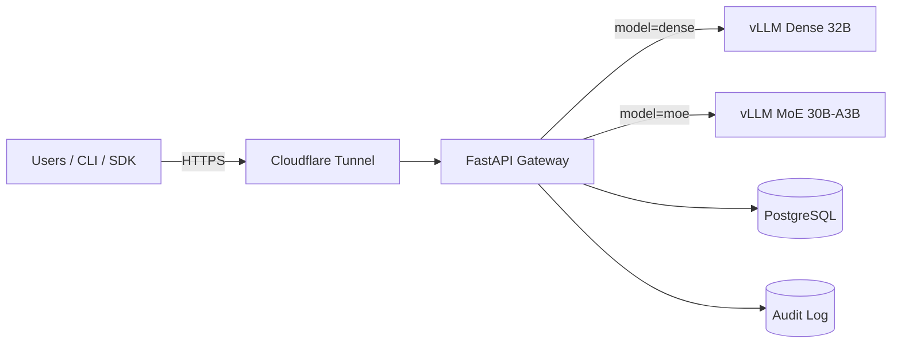

## diagram-02 — 사용자 여정 / User Journey
- **Type:** flowchart
- **KO:** 사용자가 키 발급부터 첫 응답까지 거치는 단계
- **EN:** From key issuance to first response
- **Used in:** book Ch.1, manual §1


## diagram-03 — B200 노드 토폴로지 / B200 Node Topology
- **Type:** flowchart (cluster shape)
- **KO:** 8장 B200, NVLink 도메인, PCIe 분리, HBM 180GB
- **EN:** 8×B200 with NVLink groups, PCIe lanes, 180GB HBM
- **Used in:** book Ch.2
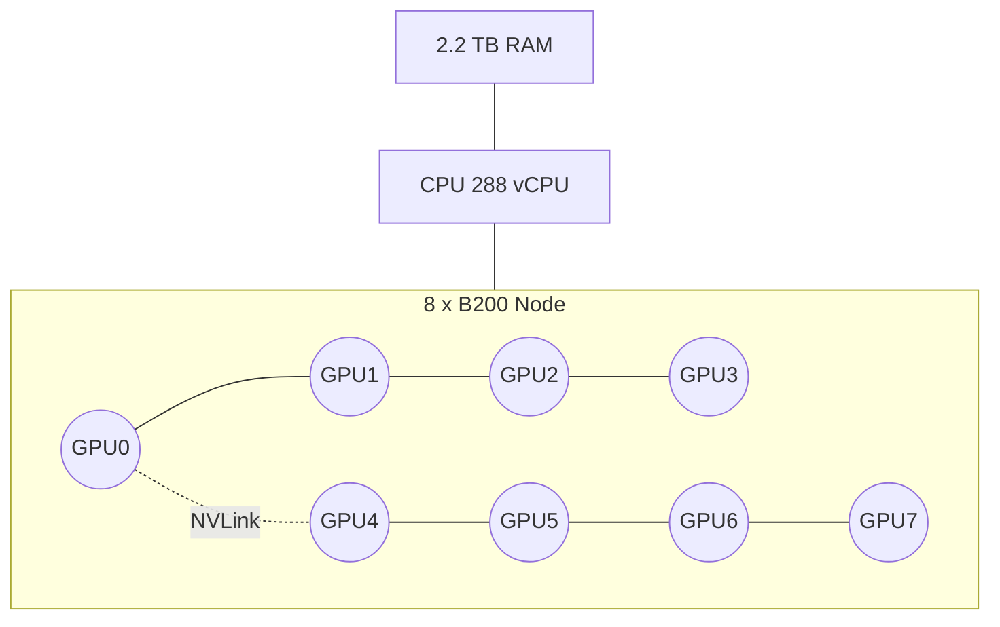

## diagram-04 — Pod–GPFS–Tunnel 인프라 / Pod-GPFS-Tunnel Infra
- **Type:** deployment
- **KO:** K8s Pod 안에 모든 컴포넌트, GPFS 마운트, Cloudflare Tunnel 진입
- **EN:** Single K8s pod with GPFS mount and Cloudflare ingress
- **Used in:** book Ch.2/Ch.13
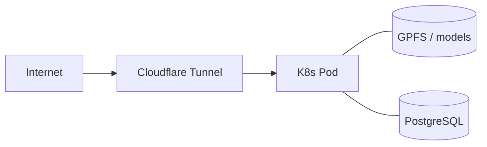

## diagram-05 — Dense vs MoE 구조 비교 / Dense vs MoE Architecture
- **Type:** flowchart
- **KO:** 32B Dense는 모든 파라미터 활성, MoE는 top-k expert
- **EN:** Dense activates all params; MoE activates top-k experts
- **Used in:** book Ch.3
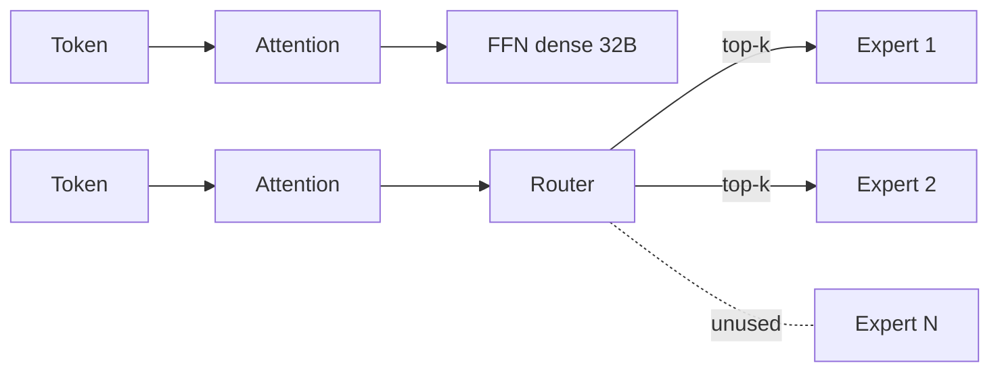

## diagram-06 — 컴포넌트 관계도 / Component Diagram
- **Type:** class / component
- **KO:** 6대 컴포넌트(vLLM x2, Gateway, CLI, Admin UI, Auth) 의존성
- **EN:** Six-component dependency graph
- **Used in:** book Ch.4, paper Fig.2
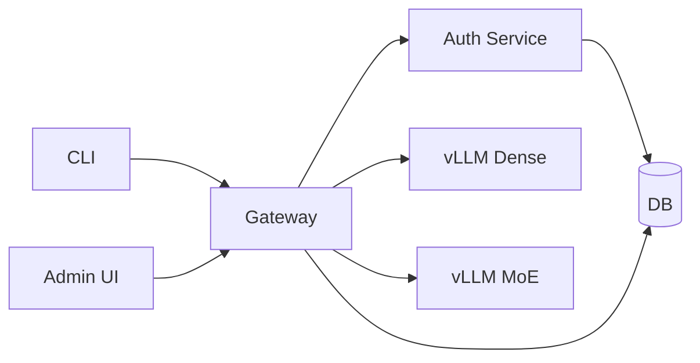

## diagram-07 — 요청 라이프사이클 / Request Lifecycle
- **Type:** sequence
- **KO:** CLI 요청 → Gateway → vLLM → 응답 스트리밍
- **EN:** End-to-end request flow
- **Used in:** book Ch.4
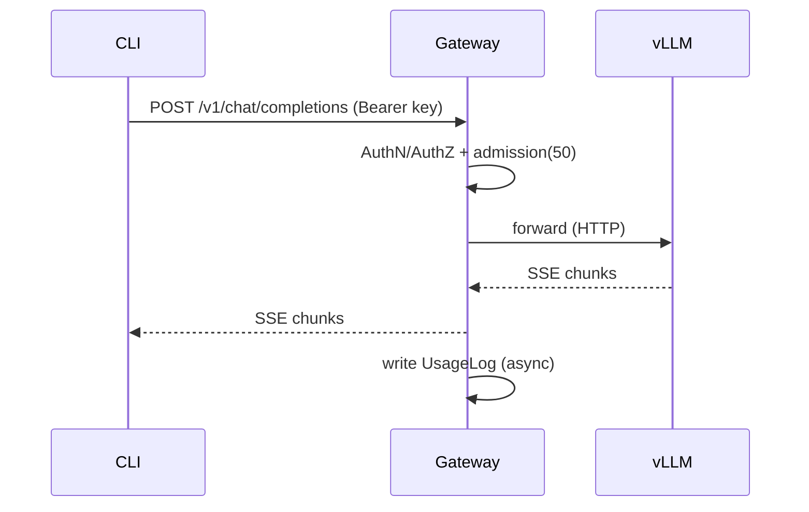

## diagram-08 — 외부 의존성 지도 / External Dependency Map
- **Type:** flowchart
- **KO/EN:** Cloudflare, GPFS, HF Hub
- **Used in:** book Ch.4
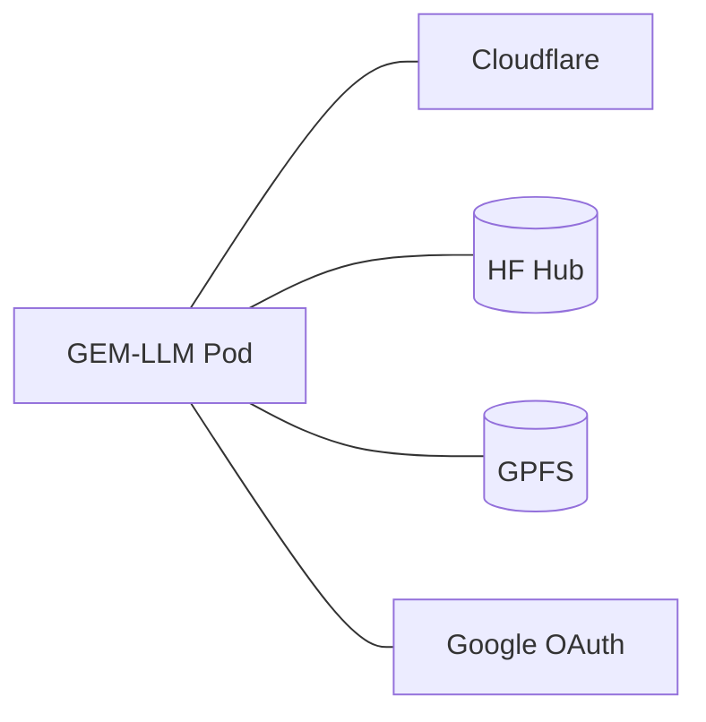

## diagram-09 — Gateway 내부 구조 / Gateway Internals
- **Type:** flowchart
- **KO:** auth → router → semaphore → upstream client → SSE
- **EN:** Pipeline of gateway middlewares
- **Used in:** book Ch.9, paper Fig.5
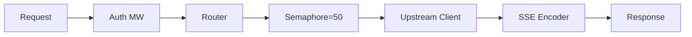

## diagram-10 — 스트리밍 시퀀스 / Streaming Sequence
- **Type:** sequence
- **KO:** SSE delta 청크 흐름
- **Used in:** book Ch.9
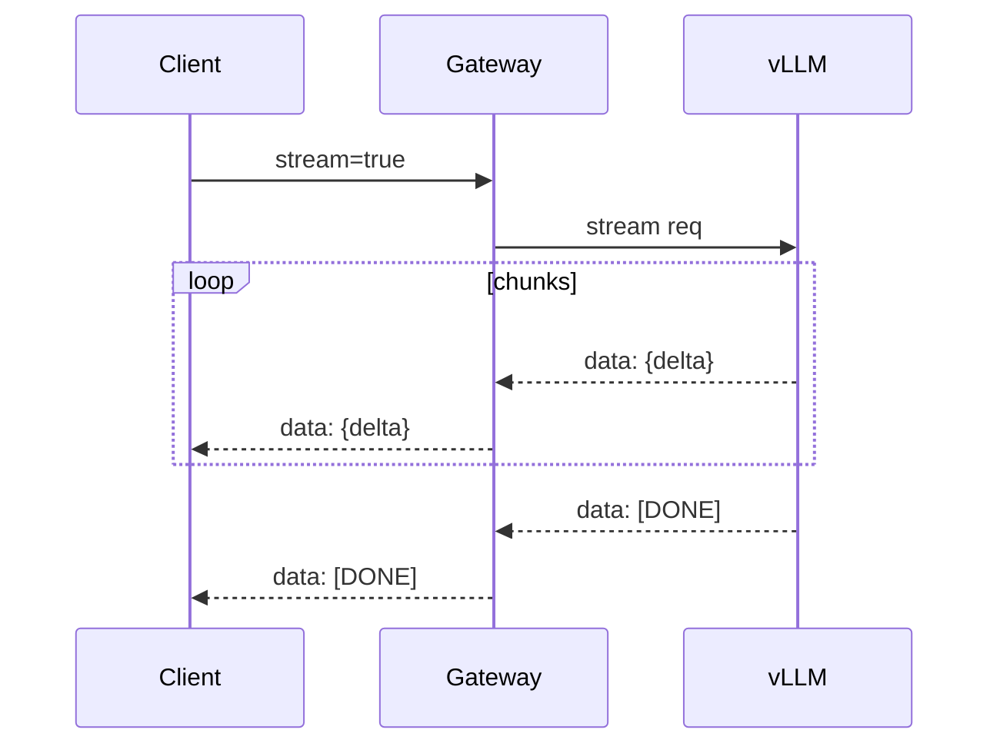

## diagram-11 — Embeddings 처리 시퀀스 / Embeddings Sequence
- **Type:** sequence
- **Used in:** book Ch.9
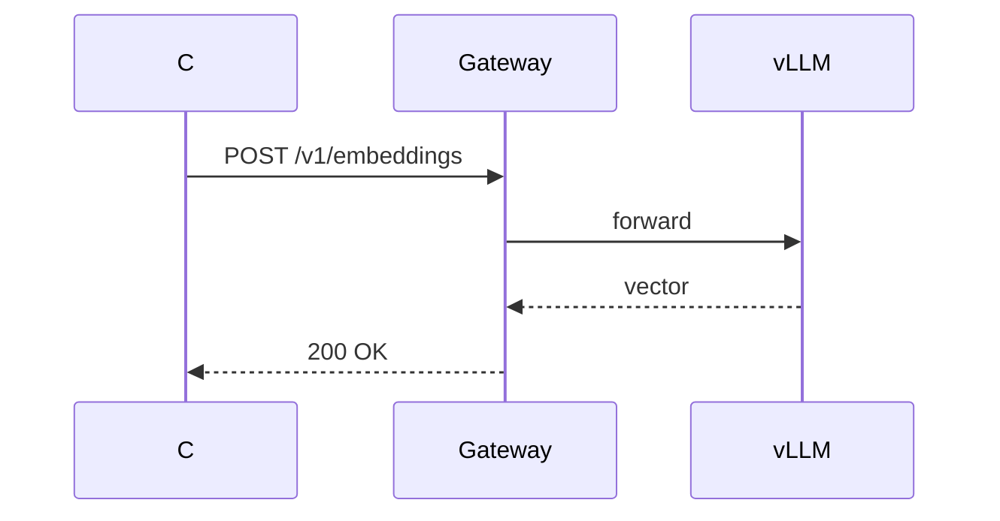

## diagram-12 — Tool Calling 시퀀스 / Tool Calling Sequence
- **Type:** sequence
- **Used in:** book Ch.10
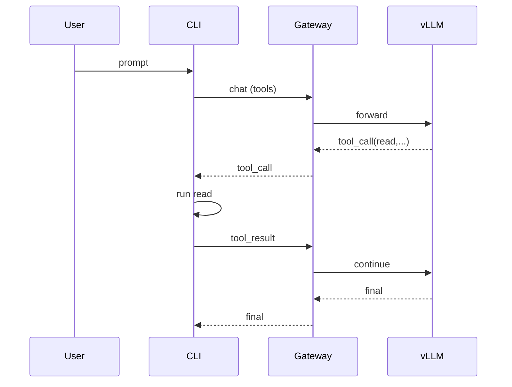

## diagram-13 — API Key 검증 흐름 / API Key Verification
- **Type:** flowchart
- **KO/EN:** Bearer 헤더 → 해시 비교 → scope/rate 체크
- **Used in:** book Ch.7, manual §3, paper Fig (auth)
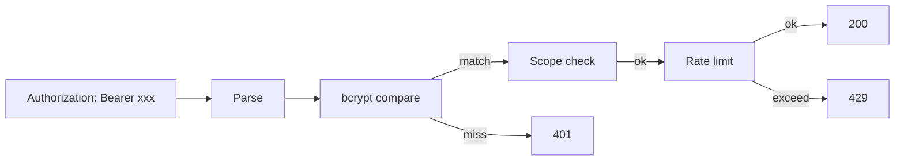

## diagram-14 — Google OAuth 플로우 / Google OAuth Flow
- **Type:** sequence
- **Used in:** book Ch.7/Ch.12, manual §16
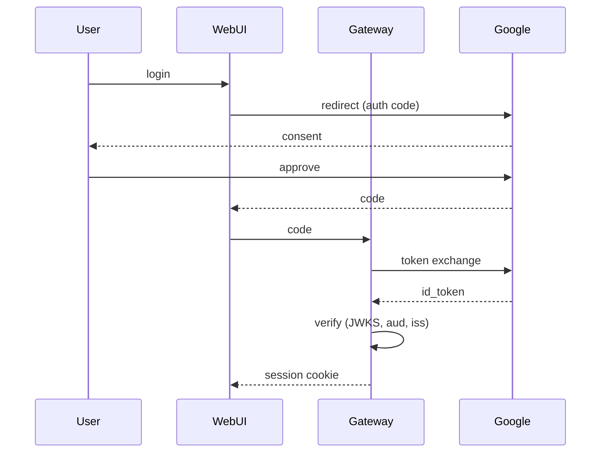

## diagram-15 — 세션 + API key 통합 / Session + API Key
- **Type:** flowchart
- **Used in:** book Ch.12
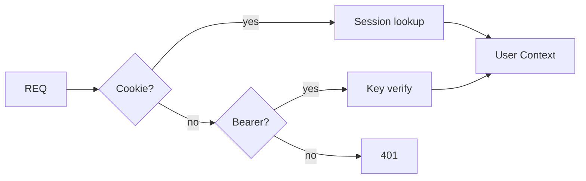

## diagram-16 — RBAC 권한 매트릭스 / RBAC Matrix
- **Type:** class
- **Used in:** book Ch.7
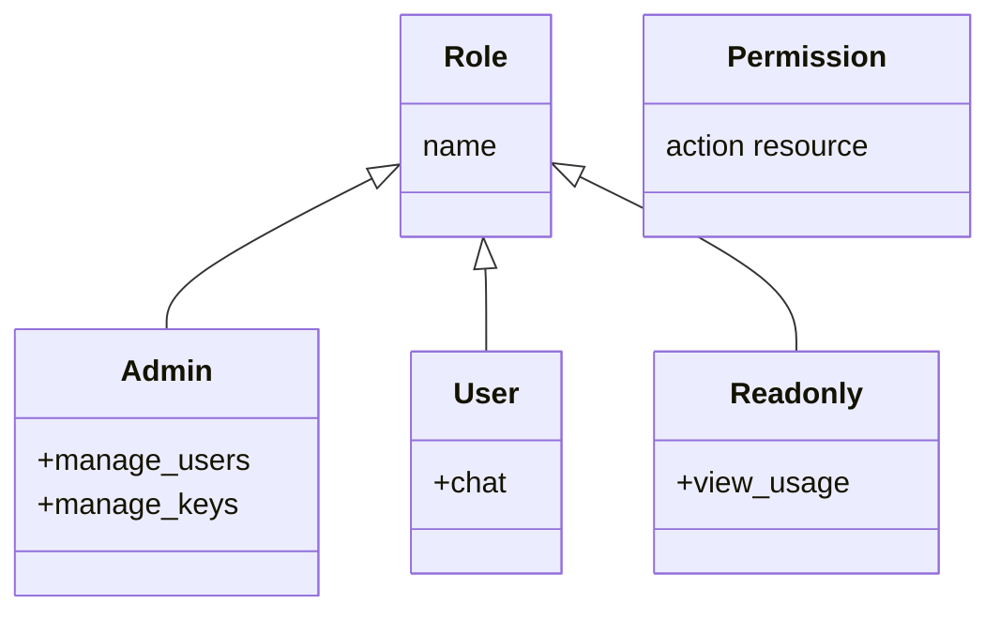

## diagram-17 — 8 GPU 분할 / 8-GPU Partitioning
- **Type:** flowchart
- **Used in:** book Ch.5/Ch.8, paper Fig.3
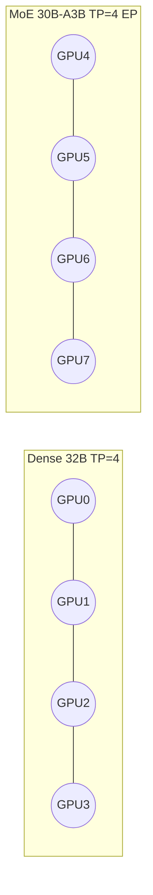

## diagram-18 — Dense launch 흐름 / Dense Launch Flow
- **Type:** flowchart
- **Used in:** book Ch.8
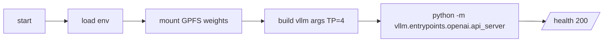

## diagram-19 — MoE launch 흐름 / MoE Launch Flow
- **Type:** flowchart
- **Used in:** book Ch.8, manual §17
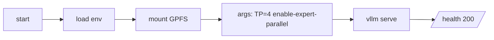

## diagram-20 — KV 캐시 구조 / KV Cache Structure
- **Type:** flowchart
- **Used in:** book Ch.8
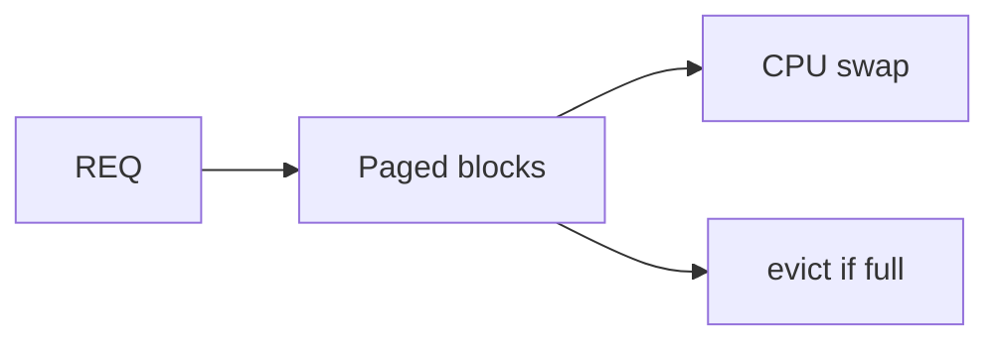

## diagram-21 — ERD / Data Model
- **Type:** ER
- **Used in:** book Ch.6, paper Fig.4
```mermaid
erDiagram
  USER ||--o{ APIKEY : owns
  USER ||--o{ CONVERSATION : has
  CONVERSATION ||--o{ MESSAGE : contains
  USER ||--o{ USAGELOG : generates
  APIKEY ||--o{ USAGELOG : tagged
```

## diagram-22 — UsageLog 시계열 모델 / UsageLog Time-Series
- **Type:** ER / partition diagram
- **Used in:** book Ch.6
```mermaid
flowchart LR
  IN[Insert] --> P[(usagelog_yyyy_mm)]
  P --> AGG[Daily rollup]
  AGG --> DASH[Grafana]
```

## diagram-23 — 멀티 노드 확장 가설 / Multi-Node Scaling (Future)
- **Type:** flowchart
- **Used in:** book Ch.18
```mermaid
flowchart LR
  N1[Node 1] --- N2[Node 2]
  N1 --- N3[Node 3]
  N2 --- N3
  GW2[Gateway] --> N1
  GW2 --> N2
```

## diagram-24 — RAG 통합 / RAG Integration (Future)
- **Type:** flowchart
- **Used in:** book Ch.18
```mermaid
flowchart LR
  Q[Query] --> EMB[Embed]
  EMB --> VDB[(Vector DB)]
  VDB --> CTX[Context]
  CTX --> GEN[LLM]
```

## diagram-25 — 배포 토폴로지 / Deployment Topology
- **Type:** deployment
- **Used in:** book Ch.13, paper Fig.6
```mermaid
flowchart LR
  Dev[Engineer] -->|kubectl apply| K8s
  K8s --> Pod
  Pod --> CFD[cloudflared]
  CFD --> CFEdge[CF Edge]
  CFEdge --> Internet
```

## diagram-26 — Tunnel 흐름 / Tunnel Flow
- **Type:** sequence
- **Used in:** book Ch.13, manual §20
```mermaid
sequenceDiagram
  participant U as Client
  participant E as CF Edge
  participant CFD as cloudflared
  participant GW as Gateway
  U->>E: HTTPS llm.pamout.com
  E->>CFD: outbound tunnel
  CFD->>GW: localhost:8080
  GW-->>CFD: response
  CFD-->>E: response
  E-->>U: response
```

## diagram-27 — Secret 관리 / Secrets Management
- **Type:** flowchart
- **Used in:** book Ch.13
```mermaid
flowchart LR
  SRC[Sealed secret] --> K8s
  K8s --> ENV[Env in Pod]
  ENV --> APP[Gateway]
```

## diagram-28 — 모델 재시작 절차 / Model Restart Procedure
- **Type:** flowchart
- **Used in:** book Ch.13, manual §13
```mermaid
flowchart LR
  ADMIN[Admin] --> DRAIN[Drain traffic for model]
  DRAIN --> KILL[SIGTERM vLLM]
  KILL --> START[start new]
  START --> WARM[warm-up]
  WARM --> RESUME[resume routing]
```

## diagram-29 — CLI 시작 흐름 / CLI Bootstrap
- **Type:** flowchart
- **Used in:** book Ch.10, manual §4
```mermaid
flowchart LR
  S[gemcli chat] --> LOAD[load credentials]
  LOAD --> PING[/v1/models/]
  PING --> REPL[REPL ready]
```

## diagram-30 — 도구 호출 시퀀스 / Tool Invocation Sequence
- **Type:** sequence
- **Used in:** book Ch.10, manual §5
```mermaid
sequenceDiagram
  participant U
  participant CLI
  participant TR as ToolRunner
  participant FS as Filesystem
  U->>CLI: ask edit file
  CLI->>TR: edit(path,old,new)
  TR->>FS: read+write
  FS-->>TR: ok
  TR-->>CLI: result
  CLI-->>U: render
```

## diagram-31 — 슬래시 명령어 처리 / Slash Command Handling
- **Type:** flowchart
- **Used in:** book Ch.10, manual §6
```mermaid
flowchart LR
  IN[/cmd args/] --> P[Parse]
  P --> D{which?}
  D -->|/help| H[print help]
  D -->|/model| M[switch]
  D -->|/login| L[browser flow]
  D -->|other| O[exec]
```

## diagram-32 — 스트리밍 렌더 루프 / Streaming Render Loop
- **Type:** sequence
- **Used in:** book Ch.10
```mermaid
sequenceDiagram
  participant CLI
  participant G as Gateway
  CLI->>G: stream req
  loop chunks
    G-->>CLI: delta
    CLI->>CLI: append + repaint markdown
  end
```

## diagram-33 — Admin 대시보드 와이어 / Admin Dashboard Wireframe
- **Type:** flowchart (wireframe)
- **Used in:** book Ch.11, manual §9
```mermaid
flowchart TB
  HDR[Header: GEM-LLM Admin]
  KPI[KPIs: Active Users / Requests / GPU%]
  CHART[Throughput chart]
  TBL[Recent errors table]
  HDR --> KPI --> CHART --> TBL
```

## diagram-34 — 사용자 관리 와이어 / User Mgmt Wireframe
- **Type:** flowchart (wireframe)
- **Used in:** book Ch.11, manual §10
```mermaid
flowchart TB
  S[Search box]
  T[User table: email role status]
  B[Buttons: add disable role]
  S --> T --> B
```

## diagram-35 — 사용량 분석 와이어 / Usage Analytics Wireframe
- **Type:** flowchart
- **Used in:** book Ch.11
```mermaid
flowchart TB
  F[Filters: range model user]
  C[Stacked tokens chart]
  TB[Top users table]
  F --> C --> TB
```

## diagram-36 — 모니터링 토폴로지 / Monitoring Topology
- **Type:** deployment
- **Used in:** book Ch.14
```mermaid
flowchart LR
  vLLM --> Prom[Prometheus]
  GW --> Prom
  DCGM[DCGM] --> Prom
  Prom --> Graf[Grafana]
  Prom --> AM[Alertmanager]
  AM --> Slack
```

## diagram-37 — 대시보드 와이어 / Dashboard Wireframe
- **Type:** flowchart
- **Used in:** book Ch.5/Ch.14/Ch.17, paper Fig.7
```mermaid
flowchart TB
  P1[TTFT p95] --- P2[TPOT p95]
  P3[RPS] --- P4[Queue depth]
  P5[GPU util] --- P6[KV usage]
  P7[Error rate]
```

## diagram-38 — 알람 흐름 / Alert Flow
- **Type:** sequence
- **Used in:** book Ch.14
```mermaid
sequenceDiagram
  participant Prom
  participant AM as Alertmanager
  participant Slack
  Prom->>AM: rule fired (p95>2s 5m)
  AM->>Slack: webhook payload
  Slack-->>OnCall: notify
```

## diagram-39 — Skills/MCP/Hooks 데이터 흐름 / Skills/MCP/Hooks Flow
- **Type:** flowchart
- **Used in:** book Ch.15
```mermaid
flowchart LR
  PROMPT --> HOOK1[pre-prompt hook]
  HOOK1 --> LLM
  LLM --> TOOLS[Skills/MCP]
  TOOLS --> HOOK2[post-tool hook]
  HOOK2 --> OUT
```

## diagram-40 — 장애 흐름 트리 / Failure Tree
- **Type:** flowchart
- **Used in:** book Ch.16, manual §20
```mermaid
flowchart TB
  ROOT[5xx spike]
  ROOT --> A[Tunnel down?]
  ROOT --> B[vLLM down?]
  ROOT --> C[DB down?]
  B --> B1[GPU OOM]
  B --> B2[Weights missing]
  A --> A1[restart cloudflared]
  C --> C1[connection pool]
```

---

## Index by Chapter / Section

| Chapter / Section | Diagram IDs |
|---|---|
| Book Ch.1 / Manual §1 | 01, 02 |
| Book Ch.2 | 03, 04 |
| Book Ch.3 | 05 |
| Book Ch.4 | 06, 07, 08 |
| Book Ch.5 (Atlas) | 01, 06–08, 13–22, 25–32, 36–38 |
| Book Ch.6 | 21, 22 |
| Book Ch.7 | 13, 14, 16 |
| Book Ch.8 | 17, 18, 19, 20 |
| Book Ch.9 | 09, 10, 11 |
| Book Ch.10 | 12, 29, 30, 31, 32 |
| Book Ch.11 / Manual Admin | 33, 34, 35 |
| Book Ch.12 | 14, 15 |
| Book Ch.13 | 25, 26, 27, 28 |
| Book Ch.14 | 36, 37, 38 |
| Book Ch.15 | 39 |
| Book Ch.16 | 40 |
| Book Ch.17 | 37 |
| Book Ch.18 | 23, 24 |
| Paper (KO/EN) | 01, 06, 09, 17, 21, 25, 37 |
